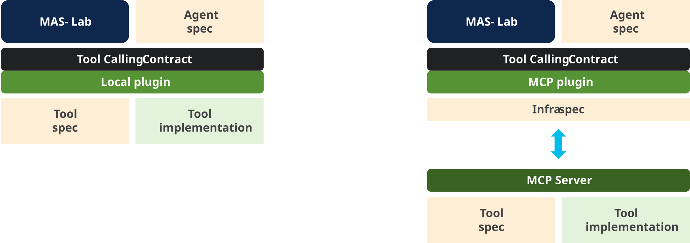
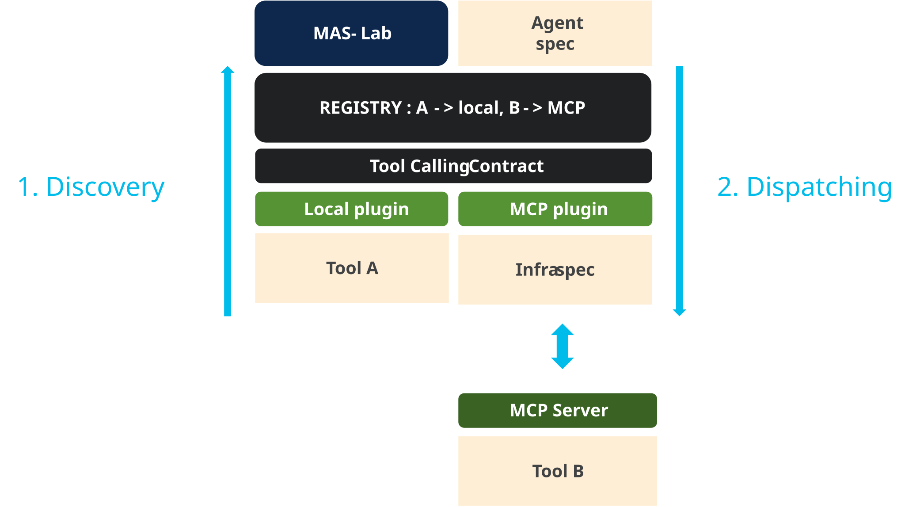

# Tutorial 4: MCP tools

This tutorial moves a tool from in-process execution to MCP without changing
the agent's reasoning logic or the tool call seen by the model. It then extends
the example so one agent uses a local calculator and a remote web-search tool in
the same turn.

Protocol integrations are often treated as a small bolt-on, but in real systems
MCP adds a stack of work: provider discovery, routing, authentication,
transport compatibility, pagination, and protocol compliance. The value is only
real when that complexity is isolated away from the agent's business logic.

The objective of this tutorial is to show that separation clearly: the agent
still asks for the same logical tool, while infra decides whether that request is
resolved locally or through an MCP server. That gives teams a clean path to
benefit from protocol compliance, best practices, and protocol upgrades without
rewriting their agent code.

You will learn how to:

- separate a tool's logical contract from its deployment configuration;
- switch a tool between local and MCP access without rewriting agent code;
- discover MCP tools and build a unique route for every tool name;
- dispatch local and remote calls through the same `ToolContract`.

## The big win: one infra manifest, no agent rewrite

This is the most important idea in the tutorial: the same agent continues to
call `ToolContract.call_tool(name, arguments)`, and the runtime swaps the
transport by changing **infra**, not the agent's logic.

In other words, you do not rewrite the agent, the tool manifest, or the prompt
when moving from local execution to MCP. You only attach a different
`ToolServerRegistry` and let the runtime discover the provider and route the
call.

That is the key separation of concerns:

- agent logic: what the tool is and when it should be called
- tool contract: stable logical contract (`name`, `arguments`, `response`)
- infra: provider protocol, URL, auth, transport, and discovery policy

## MCP manifest mapping and defaults

The complete reference is [ToolServerRegistry](../../references/tool-server-registry.md) and [infra.md](../../manifests/infra.md#toolserverregistry).

The remote-tool config is a `ToolServerRegistry` entry under
`spec.tool_servers[]`:

```yaml
apiVersion: infra/v1
kind: ToolServerRegistry
metadata:
  name: mcp-localhost
spec:
  tool_servers:
    - id: localhost-mcp-tools
      protocol: mcp
      usage: use
      transport: streamable-http
      url: http://127.0.0.1:9001/mcp
      timeout: 30
      tools: "*"
```

The key fields and their defaults are:

| Field | Default / common value | Meaning |
| --- | --- | --- |
| `id` | required | Stable key used to identify the server in the active infra bundle. |
| `protocol` | required | For MCP, this is `mcp`. The protocol is the switch that chooses the transport adapter. |
| `usage` | `use` | `use` consumes the remote endpoint; `deploy` starts the local provider; `use-and-deploy` does both. |
| `transport` | `streamable-http` | Wire transport for the MCP server (`stdio`, `sse`, `streamable-http`, etc.). |
| `url` | required for HTTP transports | Endpoint where the remote MCP server is served. |
| `timeout` | `30` | Per-call timeout for the server request. |
| `tools` | `"*"` | Default discovery mode; the runtime fetches the names advertised by the server. |
| `headers` | `{}` | Optional auth or metadata; prefer `env:VAR` instead of hardcoded secrets. |
| `follow_pagination` | `true` | Keep following MCP pagination while listing tools. |

The runtime uses these values to discover, register, and route the remote tool
without changing the logical `ToolContract` the model sees.

## One contract, two execution locations

Three documents have different owners:

| Layer | Owns | Does not own |
| --- | --- | --- |
| Agent manifest | Which logical tools the agent may call | URLs and transports |
| `kind: Tool` manifest | Tool name, description, arguments, result semantics | Where the code runs |
| `ToolServerRegistry` infra | Provider protocol, endpoint, transport, credentials, tool claims | Agent reasoning |

The runtime invokes every tool through `ToolContract.call_tool(name,
arguments)`. A local provider and an MCP provider implement that boundary in
different ways, but neither changes the agent-facing name or argument schema.



**Figure 1:** The agent and tool contracts stay fixed. Selecting MCP replaces
the execution adapter and supplies connection data through infra; it does not
move protocol details into the agent manifest.

"Seamless" therefore means **no change to agent or tool logic**, not no
configuration. Deployment still has to select a reachable provider.

## Start the MCP provider

From the repository root, expose only `web-search` through MCP:

```bash
mas-mcp serve \
  --tool-manifest library-samples/tools/web-search.tool.yaml \
  --tool web-search \
  --transport streamable-http \
  --host 127.0.0.1 --port 9001
```

In another terminal, inspect what the server advertises and call it directly:

```bash
mas-mcp tools list --url http://127.0.0.1:9001/mcp
mas-mcp tools call --url http://127.0.0.1:9001/mcp \
  --tool web-search \
  --arguments '{"query":"MAS-Lab"}'
```

The server adapter translates the existing MAS tool manifest into MCP
`tools/list` and `tools/call`. The Python implementation remains behind the
server and does not leak into the consumer agent.

## Mix local and MCP tools

Tutorial 1's `tools` overlay already gives the agent two logical tools:

```yaml
tools:
  $op:
    add:
      - ref: samples:tools/web-search.tool.yaml
      - ref: samples:tools/calc.tool.yaml
```

The canonical [`mixed-tools.infra.yaml`](https://github.com/outshift-open/mas-lab/blob/main/library-samples/infra/mixed-tools.infra.yaml)
activates two providers:

```yaml
tool_servers:
  - id: local-tools
    protocol: local
    tools: "*"
  - id: mcp-web-search
    protocol: mcp
    usage: use
    transport: streamable-http
    url: http://127.0.0.1:9001/mcp
    tools: "*"
```

Both `tools: "*"` entries mean "claim the names this provider can supply";
they do not send all calls to both providers. MCP discovery reports only
`web-search`. The external provider claims that name first, and the local
provider keeps the remaining declared name, `calc`.

Run the unchanged agent plus its existing tools overlay:

```bash
mas-ctl chat docs/tutorials/01-building-an-agent/agent.yaml \
  -o docs/tutorials/01-building-an-agent/overlays/tools.yaml \
  --infra-ref "$PWD/library-samples/infra/mixed-tools.infra.yaml" \
  -q "Find the current Apple share price, then calculate the cost of 3 shares." \
  --trace
```

The resulting route table is:

| Tool name | Discovered owner | Dispatch |
| --- | --- | --- |
| `web-search` | `mcp-web-search` advertises it through `tools/list` | MCP `tools/call` |
| `calc` | Not advertised by MCP; available from the local manifests | Local Python call |



**Figure 2:** Discovery builds a name-to-provider registry once. During the
turn, dispatch looks up the requested name and invokes exactly one provider
through `ToolContract`.

## What happens during discovery and dispatch

1. MAS-Lab loads the agent and resolves the two `kind: Tool` manifests.
2. Infra activates the local and MCP provider plugins.
3. The MCP plugin calls `tools/list`; the local plugin lists the resolved local
   manifests.
4. The registry arbitrates ownership by tool name. An explicit claim beats a
   discovered claim; an external discovered claim beats the local catch-all.
5. When the model calls a tool, the dispatcher resolves its owner and invokes
   the common `ToolContract`.

Duplicate claims with equal priority are errors rather than silent routing
choices. Likewise, once an external provider is active, every application tool
must have an owner; the explicit local provider in this example preserves the
local fallback intentionally.

## Switch back to local access

Remove `--infra-ref` and run the same agent and overlay. With no external
provider active, both names resolve to the implicit local provider. No tool
manifest, prompt, or implementation changes:

```bash
mas-ctl chat docs/tutorials/01-building-an-agent/agent.yaml \
  -o docs/tutorials/01-building-an-agent/overlays/tools.yaml \
  -q "Calculate 28 + 22." --trace
```

## What changed

Only infra changed. MCP owns discovery, transport, endpoint policy, and wire
messages; MAS-Lab keeps the agent behavior, tool names, schemas, and
`ToolContract` stable.

For the official runner and reproducible reports, see the
[MCP compliance workflow](https://github.com/outshift-open/mas-lab/tree/main/library-ioa/compliance/mcp).
