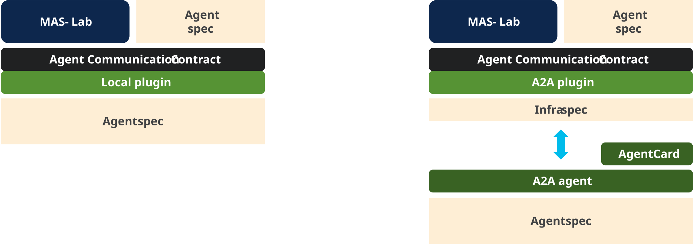
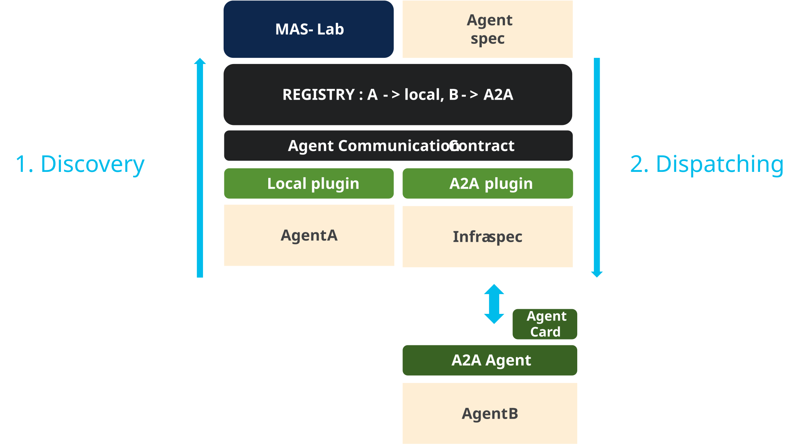

# Tutorial 5: A2A agents

This tutorial moves one delegation edge from in-process communication to A2A
without changing the MAS workflow or either agent's reasoning logic. It then
runs a mixed topology where one specialist is remote and two remain local.

A2A is not required to validate the MAS graph or agent behavior itself. It is a
production deployment concern for remote peer communication, but it should never
force the agent team to rewrite the workflow, re-specify prompts, or duplicate
protocol handling in every app. The point of the tutorial is to show exactly how
that separation works in practice.

Once the transport is moved into infra, the team can keep using the same stable
agent ids, actions, and logical delegation contracts while the platform handles
AgentCard discovery, protocol negotiation, task lifecycle semantics, and protocol
compliance. That allows a single certified integration to benefit every agent
that needs it, without repeating the same protocol work in multiple teams.

You will learn how to:

- separate delegation topology from communication infrastructure;
- expose an existing agent through A2A without rewriting it;
- discover an A2A peer's interfaces through its AgentCard;
- dispatch local and remote delegations through `AgentCommContract`.

## The big win: one infra manifest, no MAS rewrite

This tutorial is the communication equivalent of Tutorial 4. The MAS graph and
agent definition are stable; only the infra layer changes how the target is
reached.

In practice, the exactly same local delegation still resolves to the same
logical target id, but the runtime can switch that target from a local in-process
agent to an A2A peer by changing an `Application` endpoint manifest. The model,
workflow, and delegation intent do not change.

That is the real power of the design:

- business logic: which agent is called and why
- agent identity: stable target ids and delegation contract
- infra: URL, protocol, transport, endpoint exposure, and auth policy

## A2A manifest mapping and defaults

The complete reference is [A2A developer reference](../../a2a/developer.md) and [infra.md](../../manifests/infra.md#a2a-agent-endpoints).

The remote-agent config is an `Application` endpoint keyed by the exact agent id:

```yaml
apiVersion: infra/v1
kind: Application
metadata:
  name: a2a-agents-local
spec:
  endpoints:
    schedule_agent:
      protocol: a2a
      usage: use-and-deploy
      url: http://127.0.0.1:9006
      expose: true
```

The important fields to know are:

| Field | Default / common value | Meaning |
| --- | --- | --- |
| `spec.endpoints.<agent_id>.protocol` | `a2a` | Selects the A2A transport implementation for that route. |
| `spec.endpoints.<agent_id>.url` | required | The remote agent endpoint or public URL. |
| `usage` | `use` | `use` consumes the peer; `deploy` exposes a local A2A server; `use-and-deploy` does both. |
| `expose` | `false` | Set to `true` when the endpoint should be publicly advertised. |
| `headers` | `{}` | Optional auth metadata for the remote peer; prefer `env:VAR` over static secrets. |
| `timeout` | project default | Optional request timeout if the runtime supports a per-endpoint timeout. |

The important point is that the A2A-specific features are not embedded in the
MAS logic. They live in the infra endpoint config and are discovered through the
agent's AgentCard. The MAS manifest only names the target id; the endpoint map
resolves it to the correct remote peer.

## One contract, two communication paths

The logical and deployment layers answer different questions:

| Layer | Owns | Does not own |
| --- | --- | --- |
| MAS manifest | Agent ids, local definitions, workflow, `delegates_to` topology | Peer URLs and protocols |
| Agent manifest | Prompt, model, tools, skills, behavior | Whether callers are local or remote |
| `Application` infra | Endpoint id, `protocol: a2a`, URL, headers, timeout, exposure policy | Delegation intent |

The delegation layer sends every task through
`AgentCommContract.send(target_agent_id, task, ...)`. The local plugin invokes
an in-process runtime. The A2A plugin sends the same logical task through an A2A
client. The workflow does not branch on protocol.



**Figure 1:** The MAS graph and agent behavior stay fixed. Infra can replace a
local communication handler with A2A while preserving the same target id and
contract.

## Producer: expose an existing agent

The mixed example uses Tutorial 2's `schedule_agent`. The canonical
[`mixed-agents.infra.yaml`](https://github.com/outshift-open/mas-lab/blob/main/library-samples/infra/mixed-agents.infra.yaml)
endpoint has the same id:

```yaml
endpoints:
  schedule_agent:
    protocol: a2a
    usage: use-and-deploy
    url: http://127.0.0.1:9006
```

From the repository root, serve the unchanged schedule agent:

```bash
mas-ctl serve \
  "$PWD/docs/tutorials/02-creating-a-mas/agents/schedule-agent/agent.yaml" \
  --infra-ref "$PWD/library-samples/infra/mixed-agents.infra.yaml"
```

Inspect the generated protocol advertisement:

```bash
a2a card get http://127.0.0.1:9006
```

The AgentCard is not a second agent specification. It is the protocol-facing
view generated from the existing manifest: identity, skills, capabilities, and
supported interfaces. The prompt, tools, and runtime behavior remain in the
agent manifest.

## Consumer: mix local and A2A agents

Tutorial 2's MAS already delegates from `moderator` to three ids:

```yaml
workflow:
  entry: moderator
  nodes:
    - id: moderator
      delegates_to: [schedule_agent, itinerary_agent, concierge_agent]
```

Run that unchanged MAS with the mixed infra profile:

```bash
mas-ctl run-mas docs/tutorials/02-creating-a-mas/mas.yaml \
  --infra-ref "$PWD/library-samples/infra/mixed-agents.infra.yaml" \
  -q "Plan a trip and compare the available transport schedules."
```

The resulting route table is:

| Agent id | Discovered owner | Dispatch |
| --- | --- | --- |
| `schedule_agent` | Explicit `Application` endpoint with `protocol: a2a` | Remote A2A message |
| `itinerary_agent` | Materialized local agent, no remote endpoint | In-process turn |
| `concierge_agent` | Materialized local agent, no remote endpoint | In-process turn |

An explicit peer endpoint overrides a materialized local agent with the same
id. This lets the same MAS manifest run as one process during development and
as a distributed system in another environment.



**Figure 2:** Route discovery combines local materialized agents with infra
endpoints. Dispatch resolves the target id and invokes one implementation of
`AgentCommContract`; the A2A client then reads the peer AgentCard to select a
supported wire binding.

## What happens during discovery and dispatch

1. MAS-Lab materializes agents referenced by the MAS manifest and records their
   ids as local routes.
2. It reads `delegates_to` to determine which target ids need routes.
3. Active `Application` endpoints are keyed by those same agent ids.
4. An endpoint with `usage: use` or `use-and-deploy` creates an external
   agent-communication provider and overrides the local route for that id.
5. When delegation targets `schedule_agent`, the A2A client resolves its
   AgentCard and selects an advertised interface. Other target ids stay local.
6. The response crosses the same delegation boundary back to the moderator,
   regardless of transport.

Missing routes fail when the table is built, and duplicate identity is resolved
explicitly by infra rather than by network guessing. Protocol selection is
therefore deterministic and visible in configuration.

## Switch back to local communication

Run the same MAS without the infra reference:

```bash
mas-ctl run-mas docs/tutorials/02-creating-a-mas/mas.yaml \
  -q "Plan a trip and compare the available transport schedules."
```

All three specialists now use the local provider. No MAS graph, agent prompt,
delegation tool, or specialist implementation changed.

## Session continuity: `contextId` is the session id

A2A has no separate "session" concept of its own — it reuses the protocol's
`contextId`. Two requests with no `contextId` are two independent sessions;
the first response's `contextId` is the session id, and sending that same
value on a later request attaches to the same session instead of minting a
new one:

```python
from library_ioa.plugins.a2a.client import A2AClient

client = A2AClient(url="http://127.0.0.1:9006")

first = client.send_message("Plan day one around the morning train.")
print(first)  # look for "context_id" — top-level on a Task response,
              # nested under "result" on a Message response
context_id = first.get("context_id") or (first.get("result") or {}).get("context_id")

second = client.send_message("Now add day two.", context_id=context_id)
client.close()
```

`mas-a2a` (the CLI used above) does not expose a `--context-id` flag yet, so
reusing a session from the command line means calling `A2AClient` directly,
as above, rather than `mas-a2a --message`. The server-side mapping is exact:
the runtime reads the inbound `contextId` and uses it as `session_id` for
that turn; omitting it mints a new one (`library_ioa/plugins/a2a/exposure.py`).

Two callers that *do* send the same `contextId` concurrently share one
linearized turn queue — the second caller's turn is queued, not dropped or
run in parallel. That queueing, plus attaching to a session's live control
surface from a separate process, is the subject of
[Tutorial 8 — Control attach and debug](../08-control-and-debug/), which
builds directly on this same session-id mechanism.

## Direct protocol check

You can still test the remote agent independently of MAS dispatch:

```bash
a2a send -a http://127.0.0.1:9006 \
  "Find transport schedules from Luminara to Verdantia."

mas-a2a --a2a http://127.0.0.1:9006 \
  --a2a-transport JSONRPC \
  --message "Find transport schedules from Luminara to Verdantia."
```

## What changed

Only infra changed. A2A owns peer discovery, transport negotiation, task
lifecycle, and wire messages; MAS-Lab keeps the workflow, target ids, agent
behavior, and `AgentCommContract` stable.

## Reference material

- [A2A developer reference](../../a2a/developer.md) and
  [infra.md § A2A agent endpoints](../../manifests/infra.md#a2a-agent-endpoints)
  — full endpoint manifest fields.
- [Kernel operations](../../references/kernel-primitives.md) and
  [Thin waist](../../references/thin-waist.md) — where `contextId`/session id
  and the concurrent turn queue sit in the runtime's architecture.
- [A2A compliance workflow](https://github.com/outshift-open/mas-lab/tree/main/library-ioa/compliance/a2a)
  — deterministic profiles and official TCK evidence.
- Next: [Tutorial 8 — Control attach and debug](../08-control-and-debug/).
