<!--
  Copyright (c) 2026 Cisco Systems, Inc. and its affiliates
  SPDX-License-Identifier: Apache-2.0
-->
# Building the MAS runtime from Mealy machines

**Status:** Didactic companion (implementation may lag behind the formal spec)  
**Audience:** Anyone who needs to understand *why* the runtime looks like this, not only *what* the diagrams show.

This is **one document**: requirements → vocabulary → one atomic step → envelopes → machines added one by one → how to code it.

**How to read:** Part I (requirements) → **Part II (vocabulary — keep open)** → **Part III (one step, with analogy)** → rest builds on that.

---

## Part I — The problem and the requirements

### What an agent runtime must do

Strip away frameworks and buzzwords. A multi-agent runtime must:

1. Accept a **specification** (who the agent is, what tools it has, what policies apply).
2. Run a **loop**: prepare input → call a model → maybe act on the world → repeat until done.
3. Touch the **outside world** only in controlled ways (LLM APIs, tools, messages to other agents, durable stores).
4. Remain **auditable** (what went into the prompt? what I/O happened? who decided?).
5. Remain **governable** (budget, permissions, sandbox, human approval) without forking the core loop for every policy.
6. Allow **parts to be swapped** (another model provider, another vector DB, another design pattern) without rewriting the kernel.
7. **Compose** new behaviour by adding plugins, not by editing a central god-file.
8. **Fail safely** (one bad tool call or store timeout must not undefined the whole run).

These are not nice-to-haves. They are what enterprises, regulators, and multi-agent systems actually ask for.

### What goes wrong with the usual design

The default pattern is a **single loop + hooks**:

```text
while not done:
    run_hook("pre_llm")
    response = call_llm()
    run_hook("post_llm")
    for tool in parse(response):
        run_hook("pre_tool")
        run_tool()
        run_hook("post_tool")
```

This fails the requirements in predictable ways:

| Requirement | Hook-loop failure mode |
|-------------|------------------------|
| Auditable | Hooks are optional; order is conventional; easy to skip a crossing |
| Governable | Each policy registers ad hoc hooks; no single veto point |
| Swappable | Logic entangled with loop; swapping ReAct vs Plan-Execute edits the loop |
| Composable | New feature → new hook name → combinatorial interactions |
| Closure | Any plugin can import `httpx` and bypass the loop |
| Testable | Must mock the world to test “did we pause before tool X?” |
| Provenance | “Who wrote `messages[]`?” — many mutators, no commit point |

So the design question is not “Mealy vs hooks” as aesthetics. It is: **what structure is forced by the requirements above?**

---

## Part II — How we answer (plain language first)

Read this section before the symbols. Part III uses the words defined here.

### In plain English

The runtime keeps two things in sync at all times:

1. **Where each controller is** — Is the run paused? Are we assembling the prompt? Is a memory read in flight?
2. **The run data** — Messages, tool results, session flags, correlation ids.

When something happens, the **kernel** publishes one named **event** (we write it **σ**). Every controller that cares about that event updates; the rest ignore it. **No controller talks to another directly** — only through events the kernel publishes.

Any action that touches the outside world (LLM, tool, database, another agent) follows the **same recipe**: announce → policy check → log “before” → do I/O once → log “after” → policy check again → close. That recipe is an **envelope**.

The **execution engine** is the only component allowed to do real I/O. It runs only on the “do I/O” step of an envelope.

Many small controllers composed this way = **product of Mealy machines**. That is the whole idea; the rest of the document fills in names and diagrams.

### One dense sentence (same idea, formal symbols)

> The runtime is a **product of Mealy machines** over shared **(Q, τ)**, stepped by a frozen alphabet **Σ** of input symbols **σ**; every side effect is a **7-symbol envelope** in Σ; the **kernel** emits σ and never does I/O; the **execution engine** runs only on `{op}_execute`.

If that sentence is opaque, ignore it until the vocabulary table and Part III make sense — then reread it.

### Vocabulary reference

**Keep this table open.** Later parts use these words only in these senses.

| Term | Plain meaning | Concrete example |
|------|----------------|------------------|
| **Mealy machine** | A small controller: it has a **local state**, listens for **events σ**, and may change state or emit an **output** when an event arrives. | `M_tool` is IDLE until `tool_call_start`, then VALIDATING, then EXECUTING. |
| **Product (⊗)** | Several Mealy machines run **at the same time** on the **same** event σ. Global state is a **tuple** of all local states. | On `governance_authorize`, budget policy steps while the tool machine **holds** (no transition). |
| **Q / Q_product** | The tuple of all local states right now. | `(RUNNING, REASONING, ASSEMBLE, COLLECTING, IDLE, …)`. |
| **τ (tau)** | Shared **run data** — the payload every step can read/write according to rules. Not the same as “state” in Q. | `messages[]`, context parts, `call_id`, “paused” flags. |
| **σ (sigma)** | **One** kernel event — one step of the protocol. The **only** way machines interact. | `memory_read_execute`, `governance_authorize`, `agent_pause`. |
| **Σ (Sigma)** | The **complete list** of legal σ — the runtime’s public ABI. Frozen across versions like an API. | All `llm_call_*`, `tool_call_*`, `memory_read_*`, … symbols. |
| **Envelope** | A **fixed sequence** of σ for **one** side effect (seven steps: start → authorize → … → execute → … → end). | One memory read = `memory_read_start` … `memory_read_end`. |
| **Kernel** | Schedules which σ comes next; calls `kernel.step(σ, τ)`; **never** opens network sockets or files itself. | Emits `tool_call_execute`, then passes result into τ. |
| **Execution engine** | The **only** place that performs impure I/O. Invoked when σ ends with `_execute`. | HTTP call to OpenAI on `llm_call_execute`. |
| **Chokepoint family** | One of **five** classes of side effect (Execution, Model, Tool, Communication, State). Every σ belongs to one family. | `memory_read_execute` → **State** family. |
| **Hold** | A machine has **no transition** on this σ, so its local state **stays the same**. | During `llm_call_start`, `M_mem` holds at IDLE. |
| **Macro-machine** | A logical grouping (e.g. model dimension ASSEMBLE→INFER→ACT) implemented by **several** Mealy machines + kernel ordering of σ. | `M_md` is not one chart; it coordinates `M_ctx`, `M_model`, `M_tool`. |

**Why we keep this table here (not at the end of the doc):** Part II’s formal sentence and all later parts **depend** on these definitions. Dropping or shrinking the table forced you to guess what Q, τ, and σ meant in Part III. The table stays **at the front of the formal half** so you can refer back while reading.

---

## Part III — One step of the runtime (minimal kernel)

Part III explains **one atomic step** — nothing about tools, LLMs, or policies yet. Only: what moves when the kernel fires one event.

### Analogy: turn log + shared whiteboard

Imagine a turn-based simulation:

- **Q** = a row of **dials**, one per controller (“Run: RUNNING”, “Tool: IDLE”, “Memory: QUERYING”, …).
- **τ** = a **whiteboard** everyone reads/writes under strict rules (messages, ids, flags).
- **σ** = the **announcement** on the loudspeaker: “memory read, execute phase”.
- On each announcement, each controller checks: *do I have a rule for this?* If yes, flip my dial and maybe update the whiteboard. If no, **hold**.

One **turn** = one σ. A full user request = **many turns** (many σ in sequence).

### A concrete turn

Before the turn:

```text
σ about to fire:  memory_read_execute

Q = ( q_ctrl=RUNNING,  q_md=ASSEMBLE,  q_ctx=COLLECTING,  q_mem=QUERYING,  … )
τ = { messages: [...],  query: "Q3 revenue",  call_id: "abc-123" }
```

The kernel calls the **execution engine** because σ is an `_execute` step. The engine reads the vector store; result goes back into τ.

After the turn:

```text
Q = ( q_ctrl=RUNNING,  q_md=ASSEMBLE,  q_ctx=COLLECTING,  q_mem=DONE,  … )
τ = { ...,  rag_hits: [chunk1, chunk2],  call_id: "abc-123" }
```

Nothing magic: one event, dials updated where rules exist, whiteboard extended. **`M_ctrl` and `M_md` did not change** — they had no transition on `memory_read_execute`; they **held**.

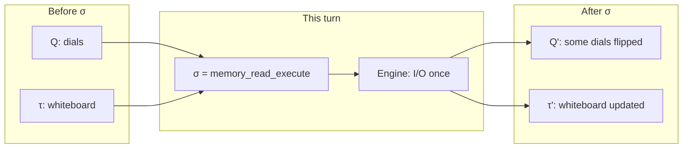

### The formula (now readable)

```text
(Q, τ) --σ--> (Q', τ')
```

Read it as:

| Piece | Meaning |
|-------|---------|
| `(Q, τ)` | Configuration **before** this turn: all dials + whiteboard |
| `σ` | The event announced this turn |
| `(Q', τ')` | Configuration **after** this turn |
| `Q'` | Same as Q except dials that had a matching rule flipped |
| `τ'` | Whiteboard after allowed writes (e.g. engine result) |

**Product rule:** for each machine *i* in the tuple Q,

```text
if machine i has a transition on σ:
    q'_i ← apply that transition
else:
    q'_i ← q_i    (hold)
```

That is the entire kernel. There is no other hidden mechanism.

### Why three pieces (Q, τ, σ) — not one big “agent state”

**Why Q is a tuple (many dials), not one enum**

Real runs combine independent facts: run **PAUSED** while tool controller is **IDLE**; design pattern **REASONING** while memory is **QUERYING**. A single `AgentState.REASONING` enum merges unrelated facts and produces nonsense (e.g. “reasoning” while paused mid-memory-read with no way to say which sub-protocol is active).

**Why τ is separate from Q**

Q = **control** (where we are in protocols). τ = **data** (what we carry). The prompt lives in τ; “may we call the LLM?” lives in Q. Mixing them makes it unclear who may write `messages[]` and when — bad for audit and provenance.

**Why σ is the only channel**

If plugins call each other directly or mutate τ without an event, you cannot **replay** the run or prove every crossing saw policy and logging. Every mutation must be triggered by a σ the kernel emitted — so traces and tests have a single timeline.

### What Part III deliberately omits

- **Which** σ come in which order for a full think → Part VIII (`M_md`, envelopes).
- **Seven-step envelopes** → Part V.
- **Individual machines** → Part VII onward.

Part III only establishes: **one turn = one σ; Q is a tuple; τ is shared data; hold vs step.**

---

## Part IV — Step 1: five chokepoint families (why not six hooks?)

**Requirement:** every side effect passes through a **mandatory door**.

Side effects classify naturally by *direction* and *kind*:

| Family | What crosses the boundary |
|--------|---------------------------|
| **Execution** | Run lifecycle (start, pause, checkpoint, stop) |
| **Model** | Inference on assembled input |
| **Tool** | Action on external systems |
| **Communication** | Message or task to another agent |
| **State** | Read/write durable or session knowledge |

**Not a sixth family:** context assembly **prepares** a model crossing; governance and observability **wrap** every crossing; the design pattern **schedules** crossings. They are not separate impure doors.

**Why this matters for machines:** each family gets a **capability machine** that owns the protocol for that door. Families are stable; plugins inside them vary.

---

## Part V — Step 2: the envelope (why seven symbols?)

**Requirement:** govern and observe **every** crossing the same way, without N custom hook names per feature.

Any side effect must answer four questions before the world changes:

1. **May** we do it? → authorize  
2. **What** was the situation before? → observe pre  
3. **Do** it (only here: impure I/O) → execute  
4. **Was** the result acceptable? → validate + observe post  

That yields a **fixed envelope** (example operation `memory_read`):

| # | σ | Primary movers |
|---|-----|----------------|
| 1 | `memory_read_start` | Caller holds; callee arms; obs opens span |
| 2 | `governance_authorize` | Each in-scope `M_gov_i`: ALLOW / DENY |
| 3 | `observability_pre` | Each in-scope `M_obs_j` |
| 4 | `memory_read_execute` | Capability machine + **execution engine** |
| 5 | `observability_post` | `M_obs_j` |
| 6 | `governance_validate` | `M_gov_i` |
| 7 | `memory_read_end` | Callee → IDLE; caller resumes |

**Governance is not a hook layer.** It is `M_gov` stepping on `governance_authorize` and `governance_validate`:

```text
δ_gov(q_gov, governance_authorize, τ) → (q_gov', ALLOW | DENY)
```

**Observability is not a listener list.** It is `M_obs` stepping on every σ in scope:

```text
δ_obs(q_obs, memory_read_start, τ) → (q_obs', EMIT_SPAN_OPEN)
```

If any in-scope gov returns DENY, the kernel does not emit `_execute` (or emits `agent_interrupt` / `agent_abort` instead).

**Why seven and not three?** Collapsing authorize/validate into execute hides veto points from replay. Collapsing obs into execute prevents pre/post snapshots. Seven is the **minimal** explicit factorization of the four questions above into σ steps that every machine can share.

---

## Part VI — Step 3: product, not pipeline

**Requirement:** add policies and tracers without serial “onion layers” that reorder behaviour.

Two compositions are often confused:

| Composition | Meaning |
|-------------|---------|
| **Sequential** A then B | B runs after A finishes; order in code matters |
| **Product** A ⊗ B | On each σ, both step if they have a transition; else hold |

Governance and observability must be **product** with capability machines:

```text
On σ = governance_authorize:
  M_ctx holds (no transition)
  M_mem holds
  M_gov_budget steps
  M_obs_otel steps
```

**Phase order** (assemble before infer) is **not** the product magically ordering itself. The **kernel scheduler** emits a **sequence** of σ:

```text
ctx_start → … → ctx_end → llm_call_start → … → llm_call_end → tool_call_start → …
```

Product = parallel on **one** σ. Kernel = order of σ **list**.

---

## Part VII — Why individual machines? (the point of decomposition)

This is the heart of the user question: **why not one machine?**

### One machine fails decomposability

A single Mealy machine with states `{IDLE, PAUSED, ASSEMBLING, CALLING_LLM, EXECUTING_TOOL, WAITING_HITL, …}` has:

- **State explosion** — legal combinations multiply (PAUSED ∧ EXECUTING_TOOL?).
- **No swap surface** — changing ReAct to Plan-Execute rewrites the same chart.
- **No plugin boundary** — budget and OTel are “states” or ad hoc flags.
- **No test isolation** — testing memory protocol requires spinning the whole chart.

### What each machine buys you

| Machine | Owns (τ slice / role) | Replace without touching |
|---------|------------------------|---------------------------|
| `M_ctrl` | Run gate | Everything below |
| `M_session` | Checkpoint durability | DP / model |
| `M_dp` | Reasoning **schedule** | LLM provider |
| `M_md` | Think-cycle **phases** | Individual sources |
| `M_ctx` | Prompt assembly + commit | Tool backends |
| `M_model` | LLM protocol | RAG layout |
| `M_tool` | Tool + HITL protocol | Model |
| `M_mem` | Store protocol | Design pattern |
| `M_trans` / `M_coord` | MAS messaging | Single-agent path |
| `M_gov_i` | One policy’s state | Other policies |
| `M_obs_j` | One tracer’s buffer | Business logic |

**Decomposability** means: *local state and local transitions for one concern, global behaviour from product + kernel schedule.*

That is how you satisfy **compose (R7)** and **swap (R6)** without a rewrite.

### Why this is the canonical solution to the requirements

We are careful with “only solution”. The precise claim:

> Given requirements R1–R8, any adequate architecture must implement (a) a **global control tuple**, (b) a **frozen crossing protocol** for side effects, (c) **parallel policy/trace** on those crossings, and (d) **one impure executor**. The product of Mealy machines over Σ is a **standard realisation** of (a–d) — like event sourcing for audit, or TCP for reliable delivery: not unique in theory, but **unique in practice** because alternatives reinvent the same factors under different names.

Hook loops implement (b) and (c) informally and lose closure. Microservices without a shared Σ lose replay. One giant state machine loses swap and test.

---

## Part VIII — Building the runtime: each machine when the design needs it

We add machines in **dependency order** — the order you would implement or explain the system from scratch.

### Layer 0 — Execution engine (not a Mealy machine)

**Need:** exactly one place allowed to be impure.

```text
engine.execute(σ, τ)  only when σ = {op}_execute
```

Not in Q. Called by kernel after gov authorize and obs pre.

---

### Machine 1 — `M_ctrl` (execution family)

**Requirement addressed:** R8 fail-safe + operator control; gate for all other work.

**Question it answers:** *May the run advance?*

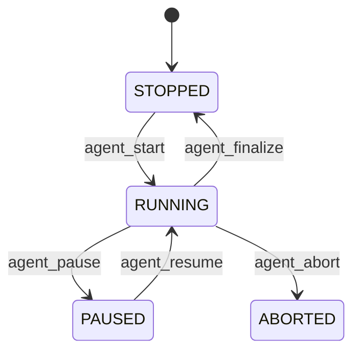

| State | Meaning |
|-------|---------|
| STOPPED | Not running or finished cleanly |
| RUNNING | Capability envelopes may be emitted |
| PAUSED | Intentional freeze (debugger, operator) |
| ABORTED | Terminal hard stop |

| σ | From → To |
|---|-----------|
| `agent_start` | STOPPED → RUNNING |
| `agent_pause` | RUNNING → PAUSED |
| `agent_resume` | PAUSED → RUNNING |
| `agent_abort` | RUNNING → ABORTED |
| `agent_finalize` | RUNNING → STOPPED |

**API surface:** `ControlContract` maps 1:1 to these σ (control plane protocol).

**Guard:** if `q_ctrl ≠ RUNNING`, kernel does not emit model/tool/state envelopes.

**Why separate from “errors”:** PAUSED is intentional and resumable. **INTERRUPTED** is policy soft-stop (budget). **ERROR** on `M_model` / `M_mem` is local fail-open. **WAITING_HITL** lives on `M_tool`, not here — pausing the whole run is not the same as approving one tool.

---

### Machine 2 — `M_session` (execution family)

**Requirement addressed:** resilience, resume after crash (R8).

**Question:** *How do we snapshot and restore `(Q, τ)`?*

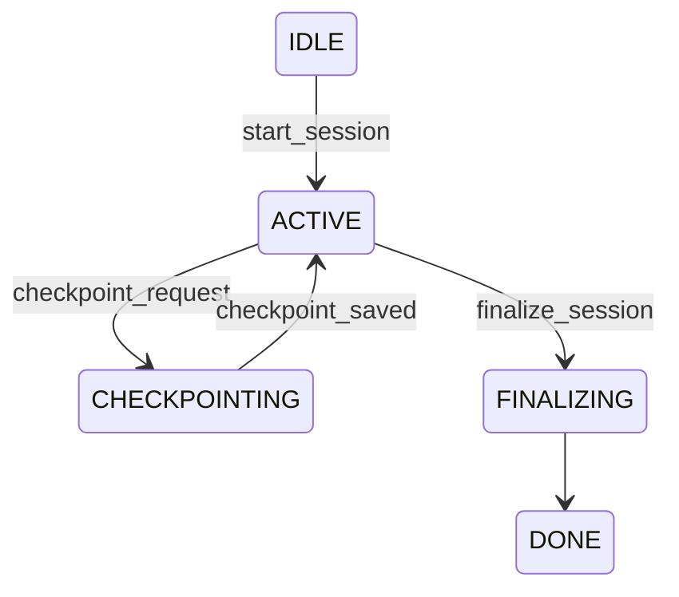

Checkpoints use the same envelope pattern: `session_checkpoint_start` … `_execute` (write blob) … `_end`.

**Why not merge into M_ctrl?** Lifecycle gate vs durable artifact are orthogonal: you can checkpoint while RUNNING; you can ABORT without a successful checkpoint.

---

### Machine 3 — `M_dp` (orchestration — not an effect family)

**Requirement addressed:** R6 swap design patterns (ReAct, CoT, Plan-Execute).

**Question:** *What kind of step comes next — think, act, or finish?*

Does **not** call the LLM. Emits schedule σ only:

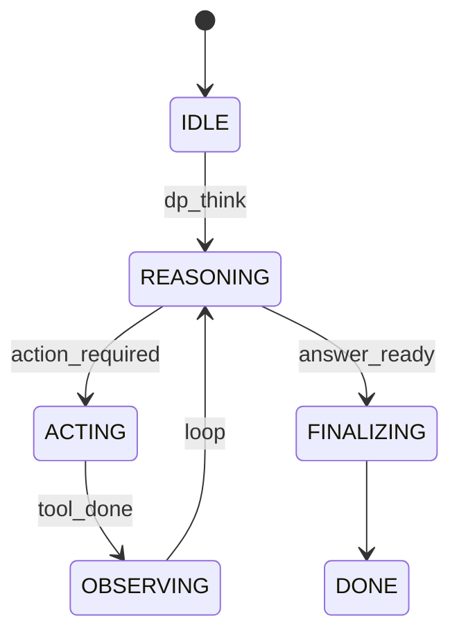

| σ (out from scheduler) | Kernel translates to |
|------------------------|------------------------|
| `dp_think` | Begin model-dimension think cycle |
| `dp_act` | Begin act phase (may skip assemble) |
| `dp_finalize` | End turn |

**Why its own machine?** Design pattern is **policy of ordering**, not **protocol of I/O**. Swapping `M_dp` swaps behaviour; Σ and `M_md` stay stable.

---

### Machine 4 — `M_md` (model-dimension macro)

**Requirement addressed:** R2 loop structure; single place for “one think cycle”.

**Question:** *Are we assembling, inferring, or acting?*

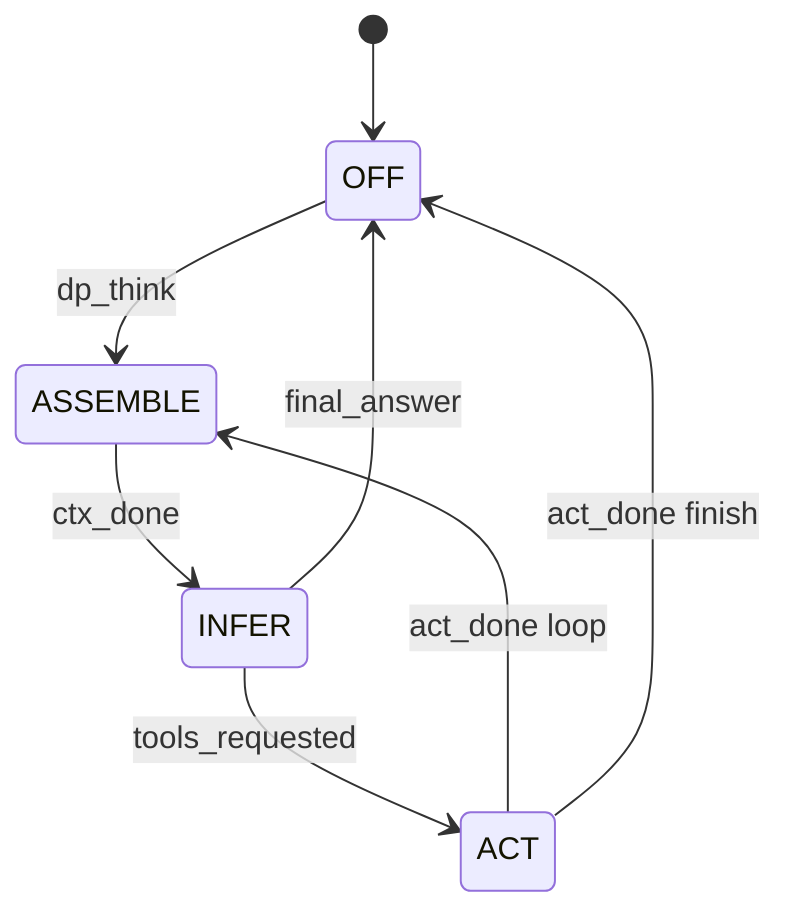

| Phase | Sub-machine activated | Envelope prefix |
|-------|----------------------|-----------------|
| ASSEMBLE | `M_ctx` | `ctx_*` |
| INFER | `M_model` | `llm_call_*` |
| ACT | `M_tool` | `tool_call_*` |

**Why a macro?** Developers think in “think → act”; auditors think in envelopes per family. `M_md` is the **orchestration view**; sub-machines are the **protocol view**. Kernel connects them via σ order.

---

### Machine 5 — `M_ctx` (model family — preparation)

**Requirement addressed:** R4 audit (what entered the prompt?); R7 compose context sources.

**Question:** *What is in `messages[]` for this inference?*

Context is **not** a sixth impure door. It is **mandatory preparation** before `llm_call_execute`.

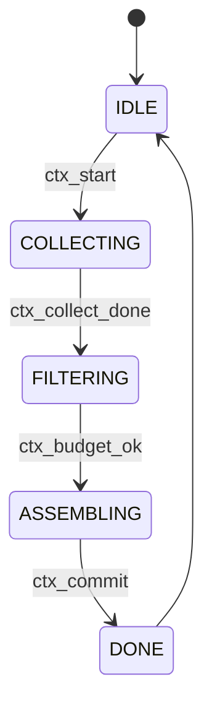

| Phase | What happens |
|-------|----------------|
| COLLECTING | Context manager trims history; sources return `ContextPart`s |
| FILTERING | Token budget on parts |
| ASSEMBLING | Order by placement; **commit** to `messages[]` |
| DONE | `ctx_part_recorded` σ per part (provenance track A) |

**Commit = governed transition:** `ctx_commit` runs `governance_authorize` / `governance_validate` on the write to `messages[]`.

**Context manager** (`manage_history`) is a **phase inside** COLLECTING/FILTERING — not a bypass around envelopes.

**Context sources** implement `collect_context(request)`. The assembler does not know RAG vs role vs tools catalog; it only knows parts and envelopes.

**Nested calls:** if a source needs the store, kernel inserts a full `memory_read_*` envelope while `q_ctx = COLLECTING` (parent holds). Same `M_mem` as when a tool reads memory later.

---

### Machine 6 — `M_mem` (state family)

**Requirement addressed:** R4 + R1 (one audit shape for store access); R6 swap backends.

**Question:** *How do we read/write durable state under policy?*

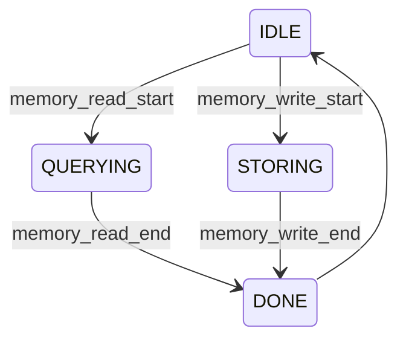

**One machine, every caller:** context collect, tool execute, post-turn write. **Requirement:** if the store is touched, the same seven-symbol envelope runs. Otherwise provenance and gov scope leak.

---

### Machine 7 — `M_model` (model family)

**Requirement addressed:** R6 swap LLM; R5 govern tokens/rate limits.

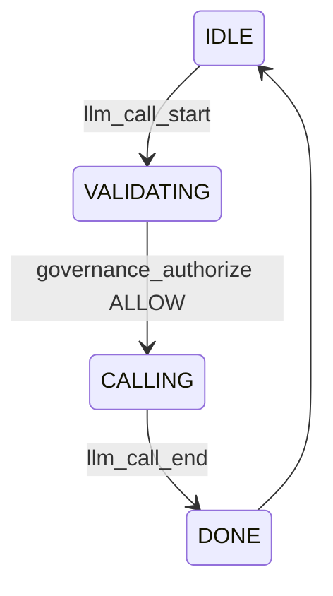

Envelope: `llm_call_start` → … → `llm_call_execute` (engine) → … → `llm_call_end`.

Batch semantics: one `llm_call_execute` may return many tool intents; kernel queues multiple `tool_call_*` envelopes — DP serializes or parallelizes per policy.

---

### Machine 8 — `M_tool` (tool family)

**Requirement addressed:** R5 permissions, sandbox, HITL; R8 fail-open on tool error.

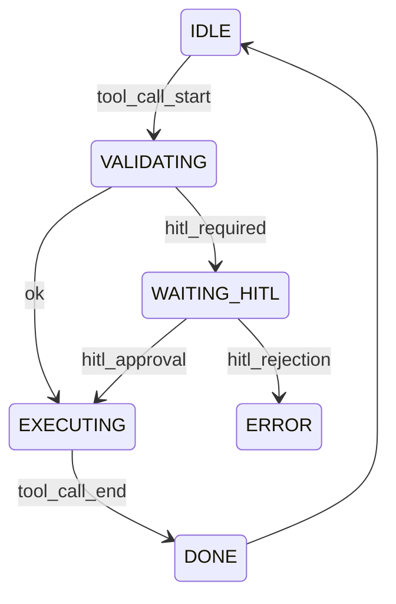

**HITL here, not on M_ctrl:** human approves **one** invocation (`hitl_approval` σ). Run-level pause remains `agent_pause`.

---

### Machines 9–10 — `M_trans`, `M_coord` (communication family)

**Requirement addressed:** multi-agent (R7 at system level).

**Question:** *How do we send/delegate/barrier parallel calls?*

Same envelope pattern: `message_send_*`, `delegation_*`, `barrier_*`. Needed when the product spans agents; optional for single-agent kernel.

---

### Machines 11–12 — `M_gov_i`, `M_obs_j` (cross-cutting product dimensions)

**Requirement addressed:** R4 audit, R5 govern, R7 compose policies/tracers.

**Not layers on top.** Each plugin instance **is** a Mealy machine in the product:

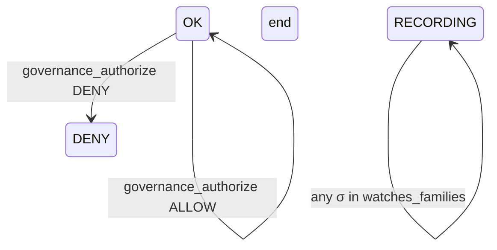

**Scoping rule (no hook names):**

```yaml
governance:
  - id: budget
    watches_families: [model, tool]
    steps_on: [governance_authorize, governance_validate]
observability:
  - id: otel
    watches_families: [execution, model, tool, communication, state]
```

On each σ, kernel applies:

```text
for each M_gov_i where family(σ) ∈ watches_i:
    (q_gov_i, τ) ← δ_gov_i(q_gov_i, σ, τ)
for each M_obs_j where family(σ) ∈ watches_j:
    (q_obs_j, τ) ← δ_obs_j(q_obs_j, σ, τ)
```

Adding a budget policy = register another `M_gov` with scope — **no edit to main loop**.

---

## Part IX — The full product

```text
Agent =
  M_ctrl ⊗ M_session ⊗ M_dp ⊗ M_md
  ⊗ M_ctx ⊗ M_model ⊗ M_tool ⊗ M_mem
  ⊗ M_trans ⊗ M_coord          (when MAS)
  ⊗ M_gov₁ ⊗ … ⊗ M_govₙ
  ⊗ M_obs₁ ⊗ … ⊗ M_obsₘ
```

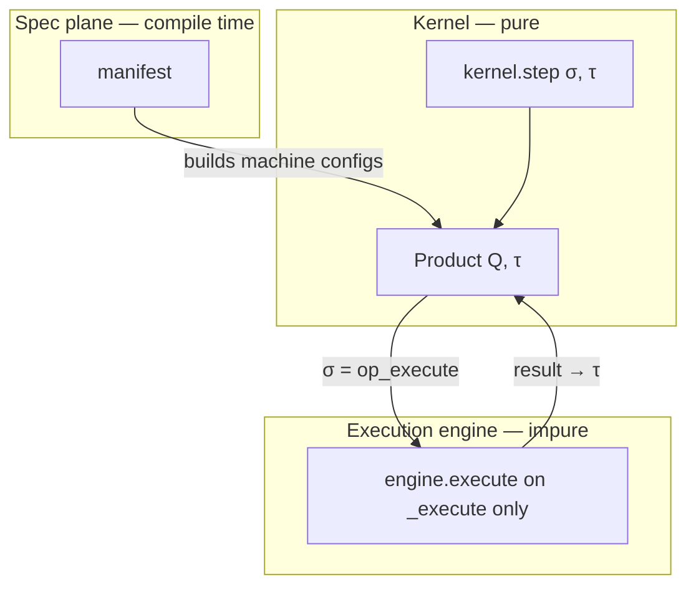

**Communication between machines:** only σ, usually in envelopes. **Developer APIs** (`collect_context`, `ToolContract.execute`) are lowered to σ sequences by the kernel.

---

## Part X — Worked example (one think)

User: “Summarise Q3 revenue.” RAG source reads memory; model returns `send_email`.

| Step | σ | q_ctrl | q_md | q_ctx | q_mem |
|------|---|--------|------|-------|-------|
| 1 | `agent_start` | RUNNING | OFF | IDLE | IDLE |
| 2 | `dp_think` | RUNNING | ASSEMBLE | IDLE | IDLE |
| 3 | `ctx_start` | RUNNING | ASSEMBLE | COLLECTING | IDLE |
| 4–7 | `memory_read_*` envelope | RUNNING | ASSEMBLE | COLLECTING | QUERYING→IDLE |
| 8 | `ctx_commit` | RUNNING | ASSEMBLE | DONE | IDLE |
| 9 | `llm_call_*` envelope | RUNNING | INFER | DONE | IDLE |
| 10 | `tool_call_*` envelope | RUNNING | ACT | DONE | IDLE |

On steps 4–7 and 9–10: in-scope `M_gov_*` steps on `governance_authorize` / `governance_validate`; all in-scope `M_obs_*` step on every σ in the envelope.

**Provenance:** track A valid at `ctx_commit` if nested envelopes completed with matching `call_id` in τ. Track B is the σ trace itself.

---

## Part XI — What you implement (why coding gets simpler)

The decomposition is not academic. It collapses the implementation to **two functions** and **machine registration**:

```text
kernel.step(σ, τ) → (Q', τ', outputs)   # pure
engine.execute(σ, τ) → result            # impure; only *_execute
```

| Task | What you do |
|------|-------------|
| New policy | Add `M_gov` instance + manifest scope |
| New tracer | Add `M_obs` instance |
| New context source | Implement `collect_context`; kernel handles nesting |
| New design pattern | Replace `M_dp` graph |
| New model provider | Register engine backend; `M_model` unchanged |
| Test | Assert `(Q,τ)` after stepping σ; mock engine only on `_execute` |

**Without decomposition:** every feature edits the loop, hook order, and tests break combinatorially.  
**With decomposition:** features are **new rows in Q** or **new σ in Σ**, not surgery on a god-object.

That is the point of individual machines: **they are the module boundaries the requirements already imply.** The product is how those modules compose without shared hidden state.

---

## Part XII — Three planes (where specs and infra sit)

| Plane | When | Role |
|-------|------|------|
| **Logic (spec)** | Compile / start | Manifests, topology, policies → resolved config |
| **Control (kernel)** | Run | Product, Σ, envelopes |
| **Infrastructure** | Bind at start | Flavours, endpoints, secrets → engine backends |

Same manifest + different flavour → **same Σ**, different engine — control semantics unchanged.

---

## Part XIII — Operator surface protocol (ctl)

Interactive ctl surfaces (**stdout console**, **curses TUI**, future REST/WS) terminate
the **boundary** between the human operator and the kernel product. They do **not**
implement concurrency control with stdin mutexes or Ctrl+C hacks — **one legal ingress
at a time** follows from the Mealy product state.

### Product gates (what the surface may offer)

| Surface prompt | Kernel ingress | Product precondition |
|----------------|----------------|--------------------|
| `You:` / `>` | `UserInputReceived` | `M_ctrl=RUNNING`, ¬`M_gov=HITL_PENDING`, turn idle |
| `HITL>` | `HitlResolve` | `M_gov=HITL_PENDING` |
| `/pause`, **STOP** | `LifecyclePause` | `M_ctrl=RUNNING` |
| `/resume`, **RESUME** | `LifecycleResume` | `M_ctrl=PAUSED` |
| `/abort`, **ABORT** | `LifecycleAbort` | not terminal |
| `/steer <text>` | `OperatorSteerReceived` | **deliberate mid-run exception** |

**Steering** is the only operator ingress intentionally allowed while a turn is in
flight. Everything else waits until the product accepts it.

### Implementation mapping (ctl)

```text
OperatorConsole / curses_app
  auto_hitl=False on SessionController.run_turn
  hitl_terminal=None (interactive governance)
  submit_hitl(..., auto_hitl=False) when M_gov pauses

Batch / CI (non-interactive)
  AutoApproveResponder or ScriptedHitlTerminal in-process
```

Stdout **OperatorConsole** and **curses TUI** share `hitl_prompt.py` for briefs and
`HitlResolve` construction. TUI exposes visual **STOP / RESUME / ABORT** toolbar
controls (mouse, Tab, F6–F8) mapping to the same lifecycle ingress as `/pause`,
`/resume`, `/abort` on the stdout console.

### Why this satisfies TLA+ intent

The surface adapter is a **serializer** on Σ_in: it never emits two ingress symbols
concurrently because it renders **one prompt mode** at a time (`USER` vs `HITL` vs
control command). Race bugs such as typing `ALLOW` at a `You:` prompt are **protocol
violations excluded by construction**, not patched with stderr multiplexing.

Non-interactive runs wire `HitlResponder` plugins (`auto-approve`, `auto-deny`) so
`M_gov` never blocks on an absent operator.

### Manifest loading (same execution engine)

Specs are **loaded into memory once** regardless of expression form:

| Form | Example | Loader |
|------|---------|--------|
| Inline dict | `pipeline: [{type: plot, ...}]` | used as-is |
| Path ref | `pipeline: analysis/pipeline.yaml` | `resolve_yaml_path` |
| Library id | `samples:agents/foo/agent.yaml` | `package_refs` |
| App bundle | `{app: trip-planner, name: pipeline}` | `resolve_app_resource` |

After resolution, **pipelines**, **agents**, **infra**, **experiments**, and
**deployment** manifests share `mas.runtime.spec.source` — execution does not branch
on how the spec was authored.

---

## References

- [mealy-product-formal-design.md](./mealy-product-formal-design.md) — full Σ listing
- [mealy-hooks-and-closure.md](./dev/contracts/mealy-hooks-and-closure.md) — closure definition
- [automaton-product-model.md](./automaton-product-model.md) — formal product
